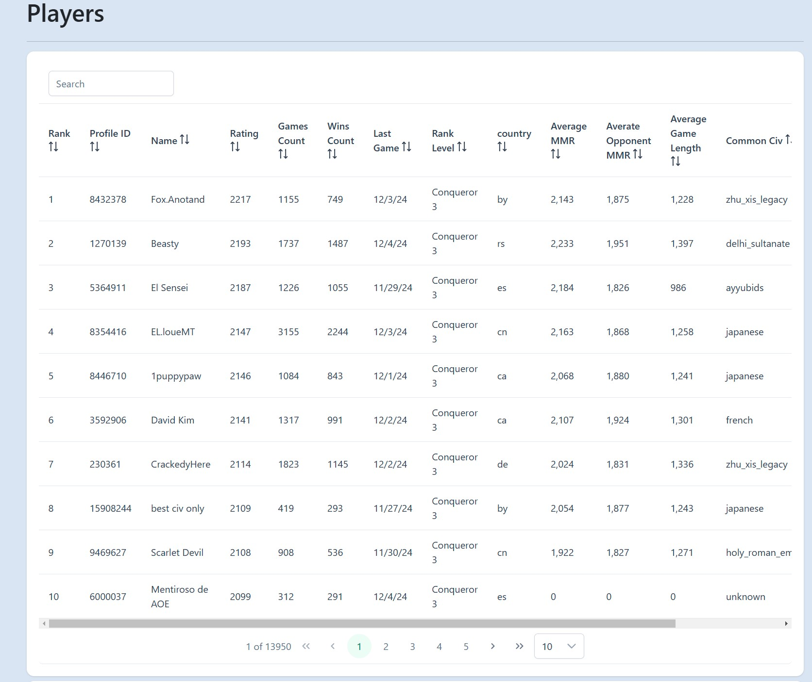
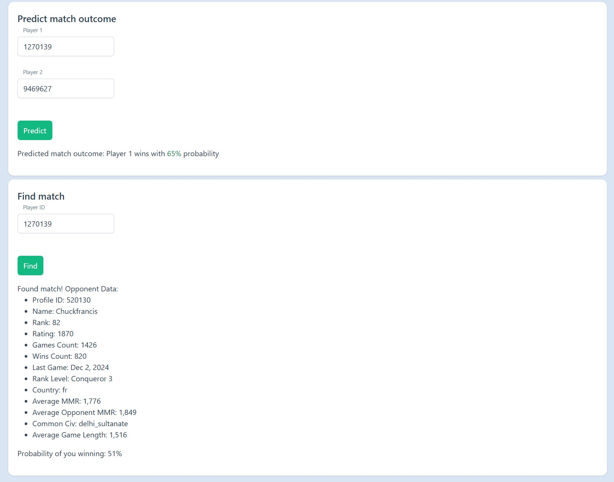

# AoE4 Matchmaking System

This project provides a machine learning-assisted matchmaking system for Age of Empires IV (AoE4). It combines player clustering, a predictive outcome model, and a traditional ELO fallback system to create fair and balanced matches between players.

The project will utilize two primary datasets derived from AoE4 game data:

1. **Ranked Games Dataset:** This dataset contains detailed information about individual ranked matches, including game identifiers, timestamps, durations, maps, server locations, and player-specific data such as profile IDs, match results, civilizations used, MMRs, MMR changes, and input types from <https://aoe4world.com/dumps>

2. **Leaderboard Dataset:** This dataset provides player rankings and performance metrics, including ranks, names, profile IDs, ratings, total games played, wins, last game timestamps, and countries from <https://aoe4world.com/dumps>

## Features

- **Data Pipeline**:  
  - Ingest and preprocess `players_df` and `games_df` datasets.
  - Compute player-level features such as rating, win rate, average MMR changes, and favorite civilizations.
  - Cluster players using KMeans into skill-based groups.

- **Match Outcome Prediction Model**:  
  - Train a classification model (XGBoost) to predict the probability that Player A will win against Player B.
  - Fine-tune model parameters using RandomizedSearchCV for improved performance.
  - Integrate the model into the matchmaking logic to produce balanced matches.

- **Matchmaking Logic**:  
  - Leverage player clusters to first attempt balanced matches.
  - If a balanced match is not found, use a fallback ELO-based approach to pair players with similar ratings.
  - Maintain a matchmaking queue and select suitable opponents dynamically.

- **Backend API (FastAPI)**:  
  - Endpoints to add players to a queue, form matches, and predict match outcomes.
  - Load trained models and clustered player data at runtime.
  
- **Frontend (Angular)**:  
  - Display player data.
  - Interact with the backend for predictions and matchmaking.
  - Visualize matches formed and probabilities of outcomes.

## Repository Structure

```graphql
├─ backend/
│  ├─ dataset/                      # Leaderboard and match history dataset
│  ├─ models/
│  │  ├─ classifier_model.xgb       # Trained XGBoost model
│  │  ├─ clustered_players.csv      # Clustered player data
│  ├─ notebooks/
│  │  ├─ BuildModel.ipynb           # Notebook to train and save the model
│  ├─ src/
│  │  ├─ core/
│  │  │  ├─ base_model.py
│  │  │  ├─ paged_query.py
│  │  │  ├─ paged_result.py
│  │  │  ├─ path_utils.py
│  │  │  ├─ result.py
│  │  ├─ matchmaking/
│  │  │  ├─ matchmaker.py           # The Matchmaker class and matchmaking logic
│  │  │  ├─ ...
│  │  ├─ models/
│  │  │  ├─ player.py
│  │  │  ├─ player_id.py
│  │  │  ├─ pair_players.py
│  │  │  ├─ predict_match_outcome.py
│  │  ├─ routers/
│  │  │  ├─ api.py
│  │  │  ├─ matchmaking_router.py   # FastAPI endpoints for matchmaking
│  │  │  ├─ players_router.py       # FastAPI endpoints for player data
│  │  ├─ services/
│  │  │  ├─ player_service.py       # Service to interact with player data
│  │  ├─ main.py                    # FastAPI app entry point
│  ├─ poetry.lock
│  ├─ pyproject.toml
│
├─ frontend/
│  ├─ src/
│  │  ├─ app/                       # Angular components and services
│  ├─ package.json
│  ├─ angular.json
│  ├─ ...
```

## Getting Started

### Prerequisites

You need the following software installed to run the project:

- [Bun](https://bun.sh/docs/installation)
- [Python 3.12](https://www.python.org/downloads)
- [Poetry](https://python-poetry.org/docs)

### Training the Model

1. Run `notebooks/BuildModel.ipynb` to:
   - Load and preprocess data.
   - Train the XGBoost classifier and find best hyperparameters.
   - Save the final model to `models/classifier_model.xgb` and clustered player data to `models/clustered_players.csv`.

### Running the Backend

1. Navigate to the `backend/` directory.
2. Install dependencies:

   ```bash
   poetry install
   ```

3. Ensure the trained model (`classifier_model.joblib`) and `clustered_players.csv` are in `models/`.
4. Start the FastAPI backend:

    ```bash
    poery run fastapi dev src/main.py
    ```

5. The API docs are available at `http://localhost:8000/docs`.

### Running the Frontend

1. Navigate to the `frontend/` directory.
2. Install dependencies:

   ```bash
   bun install
   ```

3. Start the Angular app:

    ```bash
    bun start
    ```

4. The Angular app runs at `http://localhost:8001`.

### Using the System

- **Add a Player to Queue**: POST request to `/api/matchmaking/queue` with `{"playerId": "1234"}`.
- **Remove a Player from Queue**: POST request to `/api/matchmaking/queue/remove` with `{"playerId": "1234"}`.
- **Form a Match**: POST request to `/api/matchmaking/pair` attempts to pair players with `{"playerId": "1234"}` and player details along with predicted outcome.
- **Predict Outcome**: POST request to `/api/matchmaking/predict` with `{"player1": "1234", "player2": "5678"}` returns predicted probability.
- **Get Player Data**: GET request to `/api/players/{playerId}` returns player details.
- **Get Players paged list**: GET request to `/api/players?page=1&size=10` returns a paged list of players.

## Sample screenshots




## Contact

If you have any questions or suggestions, feel free to reach out to me at my email address: <suxrobgm@gmail.com>
My LinkedIn profile: [Sukhrob Ilyosbekov](https://www.linkedin.com/in/suxrobgm/)
